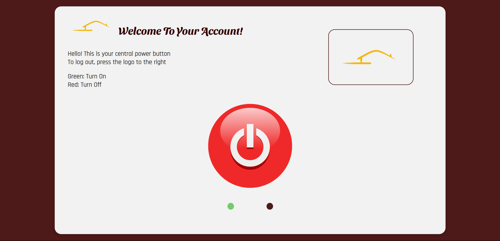
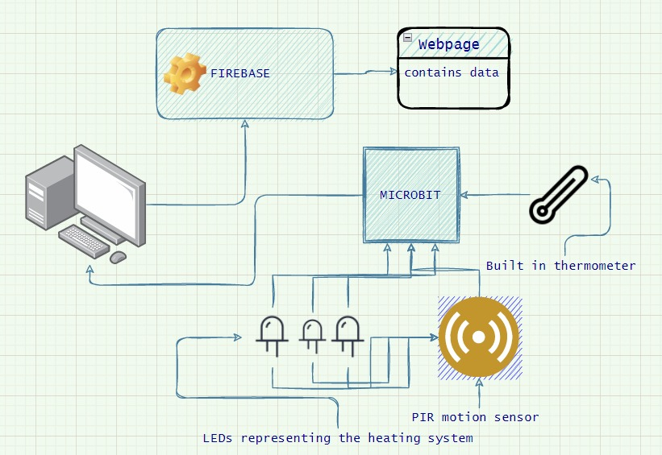

# Cosy Homes 🏠
Leaving Cert. project for Computer Science.  
Theme: Smart home systems.  
Built using [CodeSandbox](https://codesandbox.io/p/github/khatington/LC_Project). 

### Criteria 
- Create a comapny website that sells 'smart home products' with a user account connected to a database ,`Firebase`. 
- Create a physical prototype using embedded systems, `Micro:Bits`. 
- Achieve connection between user account and interaction with embedded system, shown through the real-time updates occurring in the database. 

### The project
Focused on the idea of smart heating systems using motion sensors to avoid over consumption of electricity and gas within the house. Instead of turning on the heating of the entire house, why not implement motions sensors that trigger the heating system in only occupied rooms. Including a feature where if the room meets the optimal temperature, set up by the user manually, then the system turns off. The user account also enables the user to manually turn off or on the system. 

- `Cosy homes`: the company website which includes details of the company, the location, the products and the user login. `index.html` is the home page of this website. 
- `Micro:Bit_Program.js`: the functionality for the `Micro:Bit`, PIR sensors and LEDs.
- `tester LED.py`: the code to establish connection between user account and `Firebase`.

## Images provided below 🖼️
### UI of Website and Login 

  

   
  
  

### UI of User account 

  

   
  
  

### Connection between Firebase and Thonny program 

  

   
  
  

### Architecture Diagram and Test case

  

   
  
  

> [!NOTE]
> This project was done in 2022, therefore the database in Firebase is deactivated and unfortunately I don't have any references provided.

[My portfolio](http://127.0.0.1:5500/index.html)

